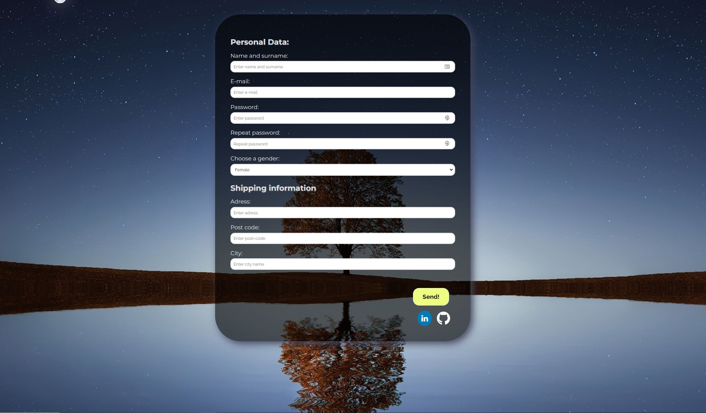

## Form in React with some validation
## Demo page: [demo](https://duckduckgo.com).

### Used technologies:
1. HTML5
2. CSS / SCSS
3. React (create-react-app, hooks: useState, useEffect, generic function for validation form values)
4. Git